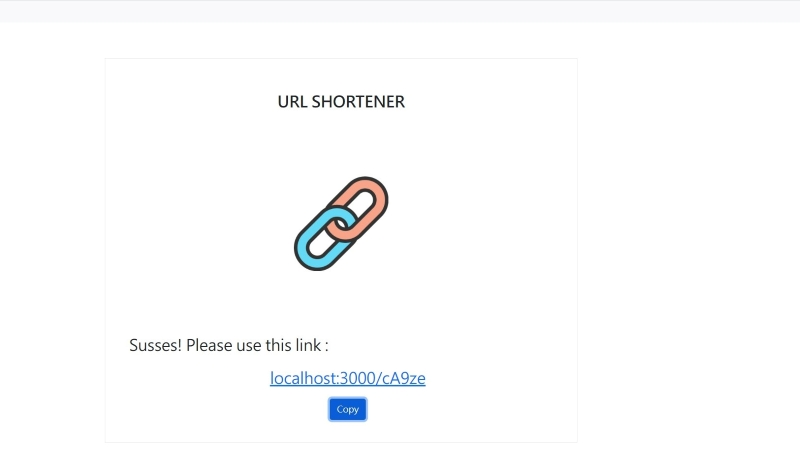

# Url shortener

在主伺服器開啟之下，讓使用者將網址縮短，並使用短網址。

## 功能介紹
* 縮短網址。
* 一鍵複製。

## 首頁瀏覽


## 功能瀏覽

!(./public/images/Url Shortener-repeated.jpg "Url shortener Repeated image.")
!(./public/images/Url Shortener-copy.jpg "Url shortener Copy image.")

## 環境建置與需求 
* npm 
* node.js 

## 安裝
1. 將專案 clone 到本地
2. 透過終端機進入資料夾，輸入:
   ```
   npm install
   ```
3. 安裝完畢後輸入:
   ```
   npm run dev
   ```
4. 看見此行訊息則代表順利運行:
   "Express start success."
5. 請在瀏覽器輸入以下網址:
   http://localhost:3000
6. 結束使用請在終端機中輸入:
   ```
   ctrl + c
   ```

## 開發工具

* express 4.18.2
* express-handlebars 6.0.6
* method-override 3.0.0
* mongoose 6.6.5
* nodemon 2.0.20
